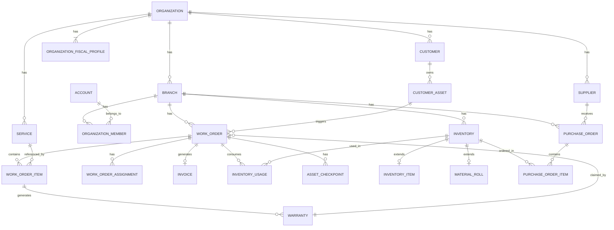

# 🚗 GlossOps

GlossOps is an operations platform built for wrap, detailing, and automotive restyling shops. It centralizes customers, vehicles, work orders, inventory, and day-to-day shop operations in one place — helping teams stay organized, reduce operational chaos, and maintain better control over materials, jobs, and deliveries.

The platform is designed for vinyl wrap shops, detailing studios, PPF installers, tint shops, ceramic coating specialists, and other automotive appearance or customization businesses. Instead of relying on WhatsApp, spreadsheets, and manual follow-ups, GlossOps provides a structured operational workflow tailored to this vertical.


---

## 📋 Table of Contents

- [🚗 GlossOps](#-glossops)
- [🏗️ Build Status](#️-build-status)
- [📸 Screenshots](#-screenshots)
- [✨ Current Scope](#-current-scope)
- [🗃️ Main Entities](#️-main-entities)
- [🛠️ Technologies](#️-technologies)
- [🚀 Getting Started](#-getting-started)
- [📁 Project Structure](#-project-structure)
- [📜 Available Scripts](#-available-scripts)
- [🔌 API Documentation](#-api-documentation)
- [🤝 Contributing](#-contributing)
- [🗺️ Vision](#️-vision)
- [🗄️ Database](#️-database)
- [📄 License](#-license)

---

## 🏗️ Build Status

> Last updated: April 2026

| Component            | Status     | Details                                                   |
| -------------------- | ---------- | --------------------------------------------------------- |
| Database schema      | ✅ Done    | Full Prisma schema, migrations, seed                      |
| API — Config         | ✅ Done    | Zod-validated env vars                                    |
| API — Auth module    | ✅ Done    | JWT + Redis refresh tokens, RBAC                          |
| API — Organizations  | ✅ Done    | CRUD, invitations with `branchId`, soft/hard delete       |
| API — Customers      | ✅ Done    | CRUD, soft/hard delete, status filters                    |
| API — Swagger UI     | ✅ Done    | Neon dark theme, OpenAPI decorators on all endpoints      |
| API — Tests          | ✅ Done    | 147 passing — 15 suites, all repositories use in-memory   |
| API — Branches       | ⏳ Next    | CRUD endpoints (peer branches, no `isMain`)               |
| API — Domain modules | ⏳ Pending | services, work-orders, inventory, suppliers, activity-log |
| Web — Auth + layout  | ⏳ Pending | —                                                         |
| Web — Core pages     | ⏳ Pending | —                                                         |
| Infrastructure       | ⏳ Pending | Dockerfiles, CI                                           |

Full roadmap: [`docs/next-steps.md`](docs/next-steps.md)

---

## 📸 Screenshots

> 🚧 Screenshots and demo coming soon as the MVP is built out.

---

## ✨ Current Scope

GlossOps is being built as a multi-tenant SaaS application focused on the core operational workflows of automotive wrap and detailing businesses.

The initial version will focus on the MVP, which includes the following capabilities:

### MVP Features

- 👥 Customer management
- 🚗 Asset management (vehicles, motorcycles, boats, and more)
- 🏢 Multi-branch organization support — peer branches, explicit `branchId` on invitations
- 🛎️ Service catalog with warranty configuration
- 📋 Work order management with warranty claim support
- 🧾 Invoice generation with CFDI 4.0 support (Mexico)
- 🛡️ Warranty management — auto-generated on job completion
- 📸 Asset reception and delivery checkpoints with photos and signature
- 📦 Inventory tracking (discrete items and roll-format materials)
- 🛒 Purchase order management per branch
- 📊 Material usage and job cost tracking
- 🖥️ Operational dashboard
- 🔐 Role-based access control per branch

### Feature Breakdown

#### 👥 Customer Management

- Create and manage customer records
- Store contact information
- Keep notes and job history

#### 🚗 Asset Management

- Register assets linked to customers — vehicles, motorcycles, boats, and more
- Track brand, model, year, color, and identifier (plate, VIN, serial number)
- Flexible metadata for domain-specific fields (engine type, trim level, hull type)
- Full work order history per asset, visible across all branches

#### 🛎️ Service Catalog

- Define standard services such as:
  - Full wrap
  - Partial wrap
  - Exterior detailing
  - Interior detailing
  - Ceramic coating
  - PPF
  - Window tint
  - Custom services
- Configure base price per service
- Set warranty terms per service — auto-generated on job completion
- CFDI fiscal codes (`claveProdServ`, `claveUnidad`) per service for invoicing

#### 📋 Work Orders

- Create and manage work orders linked to customer assets
- Add one or multiple services per job
- Assign one or multiple technicians with lead/assistant roles
- Track scheduling, status, and notes
- Support for `WARRANTY_CLAIM` type — return visits covered by an existing warranty
- Work order statuses: `DRAFT` → `CONFIRMED` → `IN_PROGRESS` → `COMPLETED` / `CANCELLED`
- Auto-generate warranties on completion for qualifying services
- Asset reception and delivery checkpoints with photos and customer signature

#### 📦 Inventory

Two types of inventory, both scoped per branch:

**Discrete items** (chemicals, coatings, applicators, microfibers, tools, blades):

- Track stock levels, unit type, SKU, and supplier
- Low stock alert threshold per item

**Roll-format materials** (vinyl wrap, PPF, window film, fabric):

- Track by remaining length in meters
- Domain-specific fields: brand, series, finish, color, width, lot number
- Lot number tracking — critical for color consistency across multi-panel jobs

#### 🛒 Purchase Orders

- Create purchase orders per branch and supplier
- Track ordered vs received quantities (supports partial deliveries)
- Automatically update stock when order is received
- Order statuses: `DRAFT` → `SENT` → `CONFIRMED` → `PARTIALLY_RECEIVED` → `RECEIVED`

#### 📊 Material Usage & Job Costing

- Record all materials consumed per work order
- Cost snapshot at time of consumption — historical accuracy guaranteed
- Basis for profitability analysis per job, per service, per branch

#### 🖥️ Operational Dashboard

- View active work orders
- Track jobs scheduled for today
- Monitor recently delivered work
- Surface low-stock inventory alerts
- Highlight wrap rolls with low remaining material
- Show estimated revenue from open jobs

#### 🏢 Multi-Tenant Organization Support

- Support multiple organizations (shops) within the platform
- Each organization can have multiple branches (physical locations) — branches are peers, no hierarchy
- The first branch is auto-created on org registration with the organization name
- Customer and asset data shared across branches — no re-registration
- Inventory and work orders scoped per branch
- Invite team members with explicit branch selection — the inviter chooses which branch the member joins
- Fiscal profiles (RFC, CSD) for CFDI 4.0 invoice generation

### 👤 Roles

The initial MVP includes the following user roles:

| Role           | Description                                        |
| -------------- | -------------------------------------------------- |
| **Owner**      | Full access to all features and settings           |
| **Manager**    | Manages operations, staff, and inventory           |
| **Technician** | Views and updates assigned work orders             |
| **Front Desk** | Handles customers, vehicles, and work order intake |

---

## 🗃️ Main Entities

The domain model is organized around a strict scope hierarchy: **global → organization → branch**.

| Scope        | Entities                                                                                                                               |
| ------------ | -------------------------------------------------------------------------------------------------------------------------------------- |
| Global       | `Brand` (system-seeded catalog)                                                                                                        |
| Organization | `Organization`, `OrganizationFiscalProfile`, `Branch`, `Customer`, `CustomerAsset`, `Service`, `Supplier`                              |
| Branch       | `OrganizationMember`, `WorkOrder`, `Inventory`, `PurchaseOrder`                                                                        |
| Derived      | `WorkOrderItem`, `WorkOrderAssignment`, `Invoice`, `Warranty`, `AssetCheckpoint`, `InventoryUsage`, `PurchaseOrderItem`, `ActivityLog` |

### Core Relationships

- An **Organization** is the tenant boundary — all data is isolated here
- An **Organization** has one or more **Branches** (physical locations)
- An **Account** belongs to branches via **OrganizationMember**, with a role per branch
- A **Customer** belongs to the organization and is visible at all branches
- A **CustomerAsset** belongs to a customer — vehicles, motorcycles, boats, or any physical item
- A **WorkOrder** is created at a branch, linked to an asset
- A **WorkOrder** can have multiple technicians via **WorkOrderAssignment**
- A **WorkOrder** can be of type `WARRANTY_CLAIM`, referencing a prior **Warranty**
- **Warranty** records are auto-generated on work order completion per service configuration
- **Invoice** is generated from a work order — includes CFDI 4.0 fiscal fields
- **Inventory** uses class table inheritance: base record + **InventoryItem** or **MaterialRoll** extension
- **InventoryUsage** records materials consumed per job with cost snapshot
- **PurchaseOrder** is placed by a branch to a **Supplier**
- **ActivityLog** is an append-only audit trail of all operational events

---

## 🛠️ Technologies

### Frontend

- **Next.js**
- **TypeScript**
- **Tailwind CSS**
- **TanStack Query**
- **React Hook Form**
- **Zod**

### Backend

- **NestJS**
- **TypeScript**
- **PostgreSQL**
- **Prisma ORM**
- **Redis**

### 🔐 Authentication & Authorization

- **JWT**
- Role-based access control (RBAC)

### ⚙️ Infrastructure & DevOps

- **Docker**
- **GitHub Actions**

### 🔮 Future Integrations

- **Stripe** for subscriptions and billing
- **AWS** for cloud infrastructure
- **Terraform** for infrastructure as code

---

## 🚀 Getting Started

### Prerequisites

Make sure you have the following installed:

- [Node.js](https://nodejs.org/) v20+
- [Docker](https://www.docker.com/) & Docker Compose
- [pnpm](https://pnpm.io/) (or npm/yarn)

### Installation

1. **Clone the repository**

```bash
git clone https://github.com/BetoNajera/GlossOps.git
cd GlossOps
```

2. **Install dependencies**

```bash
pnpm install
```

3. **Set up environment variables**

```bash
cp .env.example .env
```

Then fill in the required values in `.env`.

4. **Start the services with Docker**

```bash
docker compose up -d
```

5. **Run database migrations**

```bash
pnpm db:migrate
```

6. **Start the development server**

```bash
pnpm dev
```

The app should now be running at `http://localhost:3000` and the API at `http://localhost:4000`.

---

## 📁 Project Structure

```
glossops/
├── apps/
│   ├── web/                        # Next.js frontend (scaffolded)
│   └── api/                        # NestJS backend
│       └── src/
│           ├── auth/               # JWT auth, RBAC guards, refresh tokens
│           │   ├── decorators/     # @Public(), @Roles(), @CurrentAccount()
│           │   ├── dto/            # RegisterDto, LoginDto, TokenResponseDto
│           │   ├── guards/         # AuthGuard, RolesGuard
│           │   ├── infrastructure/ # PrismaAccountRepository, RedisTokenStore + in-memory variants
│           │   └── interfaces/     # AuthContext, JwtPayload, TokenPair
│           ├── organizations/      # Org CRUD, members, invitations (with branchId)
│           │   ├── dto/            # CreateInvitationDto, UpdateOrganizationDto
│           │   ├── infrastructure/ # PrismaOrganizationRepository, RedisInvitationStore + in-memory
│           │   └── interfaces/     # OrganizationRepositoryInterface, InvitationStoreInterface
│           ├── customers/          # Customer CRUD with soft/hard delete
│           │   ├── dto/            # CreateCustomerDto, UpdateCustomerDto
│           │   ├── infrastructure/ # PrismaCustomerRepository + in-memory
│           │   └── interfaces/     # CustomerRepositoryInterface
│           ├── config/             # Zod env validation
│           └── prisma/             # PrismaService
├── packages/
│   ├── database/                   # Prisma schema, migrations, seed
│   └── shared/                     # Shared types (pending)
├── docs/
│   ├── database-design.md
│   ├── database-constraints.md
│   ├── database-schema.dbml
│   ├── decisions/                  # Architectural decision records
│   ├── superpowers/                # Specs and implementation plans
│   └── next-steps.md
├── docker-compose.yml
├── .env.example
└── README.md
```

---

## 📜 Available Scripts

### Root

| Command      | Description                        |
| ------------ | ---------------------------------- |
| `pnpm dev`   | Start all apps in development mode |
| `pnpm build` | Build all apps for production      |
| `pnpm test`  | Run all tests                      |
| `pnpm lint`  | Run linter across the project      |

### Database (`pnpm --filter @glossops/database <script>`)

| Command      | Description                          |
| ------------ | ------------------------------------ |
| `db:migrate` | Apply pending Prisma migrations      |
| `db:reset`   | Reset database and re-run migrations |
| `db:seed`    | Seed the database with sample data   |
| `db:studio`  | Open Prisma Studio                   |
| `build`      | Compile the package to `dist/`       |

### API (`pnpm --filter api <script>`)

| Command     | Description                    |
| ----------- | ------------------------------ |
| `start:dev` | Start NestJS in watch mode     |
| `test`      | Run Jest unit tests            |
| `test:cov`  | Run tests with coverage report |
| `lint`      | Run ESLint                     |
| `build`     | Build for production           |

---

## 🔌 API Documentation

Once the API is running locally, Swagger docs are available at:

```
http://localhost:4000/docs
```

> 📬 A Postman collection will be published as the API matures.

---

## 🤝 Contributing

Contributions are welcome! Please follow these guidelines:

### Branch Naming

```
feature/short-description
fix/short-description
chore/short-description
```

### Commit Convention

This project follows [Conventional Commits](https://www.conventionalcommits.org/):

```
feat: add wrap roll inventory module
fix: correct stock calculation on usage tracking
chore: update dependencies
```

### Pull Request Process

1. Fork the repository and create your branch from `master`
2. Make your changes and ensure tests pass
3. Open a PR with a clear title and description
4. Wait for review and address any feedback

---

## 🗺️ Vision

GlossOps is intended to become a purpose-built operational system for automotive wrap, detailing, and restyling businesses. The long-term vision is to provide a modern, vertical SaaS product that helps shops run with more structure, better visibility, and stronger operational control.

---

## 🗄️ Database

> Full schema with field-level documentation: [`docs/database-schema.dbml`](docs/database-schema.dbml)  
> Design decisions and architecture: [`docs/database-design.md`](docs/database-design.md)  
> Cross-table constraints and triggers: [`docs/database-constraints.md`](docs/database-constraints.md)



---

## 📄 License

This project is licensed under the [MIT License](LICENSE).
