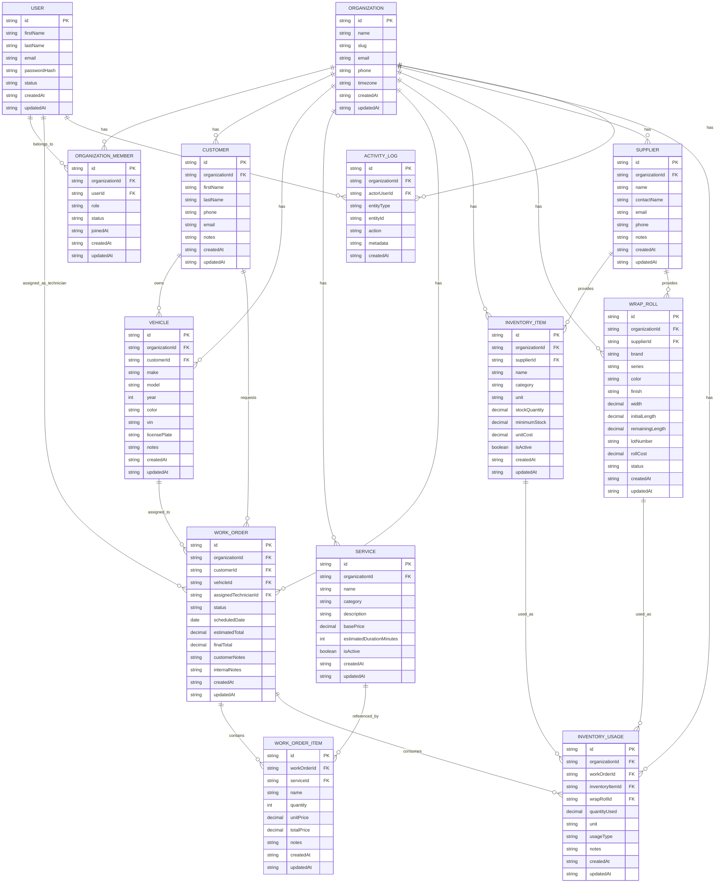

# 🚗 GlossOps

GlossOps is an operations platform built for wrap, detailing, and automotive restyling shops. It centralizes customers, vehicles, work orders, inventory, and day-to-day shop operations in one place — helping teams stay organized, reduce operational chaos, and maintain better control over materials, jobs, and deliveries.

The platform is designed for vinyl wrap shops, detailing studios, PPF installers, tint shops, ceramic coating specialists, and other automotive appearance or customization businesses. Instead of relying on WhatsApp, spreadsheets, and manual follow-ups, GlossOps provides a structured operational workflow tailored to this vertical.


---

## 📋 Table of Contents

- [🚗 GlossOps](#-glossops)
- [📸 Screenshots](#-screenshots)
- [✨ Current Scope](#-current-scope)
- [🗃️ Main Entities](#️-main-entities)
- [🛠️ Technologies](#️-technologies)
- [🚀 Getting Started](#-getting-started)
- [📁 Project Structure](#-project-structure)
- [📜 Available Scripts](#-available-scripts)
- [🔌 API Documentation](#-api-documentation)
- [🤝 Contributing](#-contributing)
- [🗺️ Vision](#️-vision)
- [🗄️ Database](#️-database)
- [📄 License](#-license)

---

## 📸 Screenshots

> 🚧 Screenshots and demo coming soon as the MVP is built out.

---

## ✨ Current Scope

GlossOps is being built as a multi-tenant SaaS application focused on the core operational workflows of automotive wrap and detailing businesses.

The initial version will focus on the MVP, which includes the following capabilities:

### MVP Features

- 👥 Customer management
- 🚙 Vehicle management
- 🛎️ Service catalog
- 📋 Work order management
- 📦 General inventory tracking
- 🎞️ Specialized wrap roll inventory
- 📊 Material usage tracking per job
- 🖥️ Operational dashboard
- 🏢 Organization and role-based access control

### Feature Breakdown

#### 👥 Customer Management
- Create and manage customer records
- Store contact information
- Keep notes and job history

#### 🚙 Vehicle Management
- Register vehicles linked to customers
- Track make, model, year, color, VIN, and license plate
- Store notes and optional photos

#### 🛎️ Service Catalog
- Define standard services such as:
  - Full wrap
  - Partial wrap
  - Exterior detailing
  - Interior detailing
  - Ceramic coating
  - PPF
  - Window tint
  - Custom services
- Configure service category, estimated duration, and base price

#### 📋 Work Orders
- Create and manage work orders
- Link customers and vehicles to each job
- Add one or multiple services to a work order
- Track scheduling, status, assigned technician, notes, and photos
- Support work order statuses such as:
  - Draft
  - Scheduled
  - In Progress
  - Waiting for Material
  - Ready for Delivery
  - Delivered
  - Cancelled

#### 📦 General Inventory
- Manage consumables and shop materials such as:
  - Chemicals
  - Coatings
  - Applicators
  - Microfibers
  - Tools
  - Blades
  - Other shop supplies
- Track stock levels, minimum stock thresholds, unit type, and supplier information

#### 🎞️ Wrap Roll Inventory
- Track wrap-specific materials with domain-specific fields such as:
  - Brand
  - Series / line
  - Color
  - Finish
  - Width
  - Initial length
  - Remaining length
  - Lot number
  - Supplier
  - Roll cost
- Monitor material availability and low-stock conditions

#### 📊 Material Usage Tracking
- Record materials consumed per work order
- Associate wrap roll usage with jobs
- Track estimated or actual usage
- Register waste or leftover notes when needed

#### 🖥️ Operational Dashboard
- View active work orders
- Track jobs scheduled for today
- Monitor recently delivered work
- Surface low-stock inventory alerts
- Highlight wrap rolls with low remaining material
- Show estimated revenue from open jobs

#### 🏢 Multi-Tenant Organization Support
- Support multiple organizations (shops) within the platform
- Isolate data by organization
- Invite team members
- Manage roles and permissions

### 👤 Roles

The initial MVP includes the following user roles:

| Role | Description |
|---|---|
| **Owner** | Full access to all features and settings |
| **Manager** | Manages operations, staff, and inventory |
| **Technician** | Views and updates assigned work orders |
| **Front Desk** | Handles customers, vehicles, and work order intake |

---

## 🗃️ Main Entities

The current domain model is centered around the following core entities:

- **User**
- **Organization**
- **OrganizationMember**
- **Customer**
- **Vehicle**
- **Service**
- **WorkOrder**
- **WorkOrderItem**
- **InventoryItem**
- **WrapRoll**
- **InventoryUsage**
- **Supplier**
- **ActivityLog**

### Core Relationships

- An **Organization** represents a shop and acts as the tenant boundary
- A **User** can belong to one or more organizations through **OrganizationMember**
- A **Customer** can own one or more **Vehicles**
- A **Vehicle** can have many **WorkOrders**
- A **WorkOrder** can include multiple **WorkOrderItems**
- A **WorkOrder** can consume one or more **InventoryItems** or **WrapRolls**
- **InventoryUsage** records the materials used for each work order
- **ActivityLog** keeps a timeline of important operational events

---

## 🛠️ Technologies

### Frontend
- **Next.js**
- **TypeScript**
- **Tailwind CSS**
- **TanStack Query**
- **React Hook Form**
- **Zod**

### Backend
- **NestJS**
- **TypeScript**
- **PostgreSQL**
- **Prisma ORM**
- **Redis**

### 🔐 Authentication & Authorization
- **JWT**
- Role-based access control (RBAC)

### ⚙️ Infrastructure & DevOps
- **Docker**
- **GitHub Actions**

### 🔮 Future Integrations
- **Stripe** for subscriptions and billing
- **AWS** for cloud infrastructure
- **Terraform** for infrastructure as code

---

## 🚀 Getting Started

### Prerequisites

Make sure you have the following installed:

- [Node.js](https://nodejs.org/) v20+
- [Docker](https://www.docker.com/) & Docker Compose
- [pnpm](https://pnpm.io/) (or npm/yarn)

### Installation

1. **Clone the repository**

```bash
git clone https://github.com/BetoNajera/GlossOps.git
cd GlossOps
```

2. **Install dependencies**

```bash
pnpm install
```

3. **Set up environment variables**

```bash
cp .env.example .env
```

Then fill in the required values in `.env`.

4. **Start the services with Docker**

```bash
docker compose up -d
```

5. **Run database migrations**

```bash
pnpm db:migrate
```

6. **Start the development server**

```bash
pnpm dev
```

The app should now be running at `http://localhost:3000` and the API at `http://localhost:4000`.

---

## 📁 Project Structure

```
glossops/
├── apps/
│   ├── web/              # Next.js frontend
│   └── api/              # NestJS backend
├── packages/
│   ├── database/         # Prisma schema and migrations
│   └── shared/           # Shared types and utilities
├── docker-compose.yml
├── .env.example
└── README.md
```

---

## 📜 Available Scripts

| Command | Description |
|---|---|
| `pnpm dev` | Start all apps in development mode |
| `pnpm build` | Build all apps for production |
| `pnpm test` | Run all tests |
| `pnpm lint` | Run linter across the project |
| `pnpm db:migrate` | Run Prisma database migrations |
| `pnpm db:studio` | Open Prisma Studio |
| `pnpm db:seed` | Seed the database with sample data |

---

## 🔌 API Documentation

Once the API is running locally, Swagger docs are available at:

```
http://localhost:4000/docs
```

> 📬 A Postman collection will be published as the API matures.

---

## 🤝 Contributing

Contributions are welcome! Please follow these guidelines:

### Branch Naming

```
feature/short-description
fix/short-description
chore/short-description
```

### Commit Convention

This project follows [Conventional Commits](https://www.conventionalcommits.org/):

```
feat: add wrap roll inventory module
fix: correct stock calculation on usage tracking
chore: update dependencies
```

### Pull Request Process

1. Fork the repository and create your branch from `master`
2. Make your changes and ensure tests pass
3. Open a PR with a clear title and description
4. Wait for review and address any feedback

---

## 🗺️ Vision

GlossOps is intended to become a purpose-built operational system for automotive wrap, detailing, and restyling businesses. The long-term vision is to provide a modern, vertical SaaS product that helps shops run with more structure, better visibility, and stronger operational control.

---

## 🗄️ Database



---

## 📄 License

This project is licensed under the [MIT License](LICENSE).
